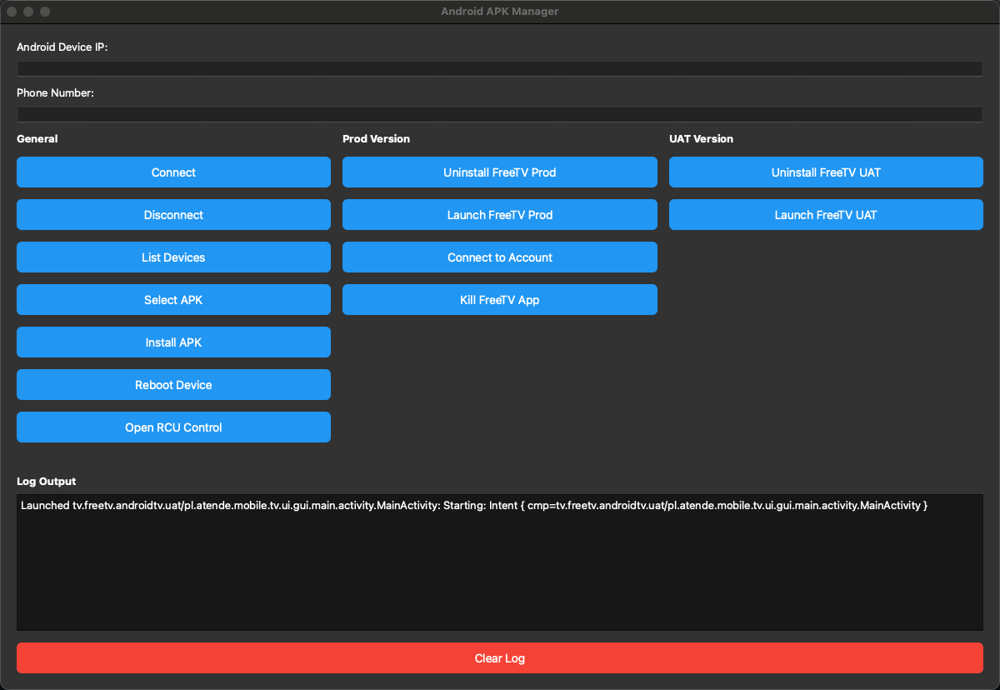

# 📱 Android Manager GUI

A powerful PySide6 desktop tool for Android TV (ATV) testing and APK management — designed for automation engineers, QA testers, and developers.

 <!-- Optional: Add a screenshot -->

---

## ✨ Features

- 🚀 **ADB Management**: Connect, install/uninstall APKs, reboot devices, and send key events
- 🤖 **Appium Integration**: Launch ATV apps and automate login workflows
- 🎮 **RCU Dialog**: Simulate keypresses from a custom Remote Control UI
- 📋 **Log Viewer**: Real-time output viewer with "Clear Log" functionality
- 🌐 Supports **UAT** and **Production** environments
- 💻 Minimal and responsive PySide6 UI

---

## 🖼️ UI Preview

> Example view with 3 columns: General, UAT, and Prod, and logging output at the bottom.

```bash
+---------------------------------------+
| General   | UAT        | Prod         |
|---------- |----------- |--------------|
| Connect   | Install UAT| Install Prod |
| RCU       | Uninstall  | Uninstall    |
| Reboot    | Login      | Login        |
|           |            |              |
+---------------------------------------+
|              Log Output               |
|          [Clear Log] Button           |
+---------------------------------------+
