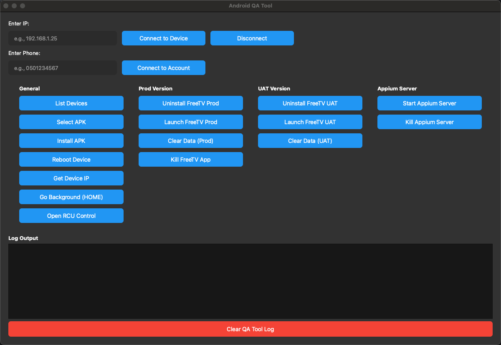
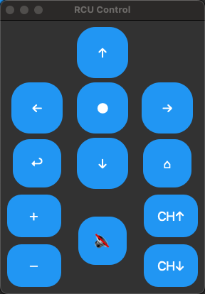

# 📱 Android QA Tool

A powerful PySide6 desktop tool for Android TV (ATV) **and** Android phones — built for QA engineers, automation testers, and developers to install APKs, control devices, collect logs, and speed up validation.

---

## ✨ Features

- 🚀 **ADB Management** – Connect via IP/USB, list devices, install/uninstall APKs, reboot
- 🧹 **App Data Controls** – One-click **Clear Data** (UAT / Prod) and **Kill App**
- 🎮 **RCU Dialog** – Send key events (Up/Down/Left/Right/OK/Back/Home, CH↑/CH↓, ± volume, etc.)
- 🤖 **Appium Server Control** – **Start / Kill Appium** from the UI (default `0.0.0.0:4723`)
- 🔁 **Env Helpers** – Streamline **UAT ↔ PROD** actions (install/launch/kill/connect)
- 🔎 **Utilities** – Get device IP, background app (HOME), log viewer with **Clear** & export
- 🖥️ **Multi-Device Support** – Target devices by IP/serial
- 🧩 **Clean UI** – Minimal PySide6 interface focused on daily QA tasks

---

## 🖼️ UI Preview

> Main window with two input fields, **four columns** (General / Prod Version / UAT Version / Appium Server), a live log area, and a large red **Clear QA Tool Log** button.



> **RCU Control** dialog for sending navigation/system keys quickly during testing.



---

## 🧱 Tech Stack

- **Python 3.10+**
- **PySide6** (desktop GUI)
- **ADB / Android Platform Tools**
- **Appium** (optional; for UI automation workflows)

---

## ⚙️ Requirements

- macOS / Windows / Linux
- **ADB** installed and available in `PATH`  
  - macOS: `brew install android-platform-tools`  
  - Windows: install Platform Tools and add to PATH
- (Optional) **Appium** for automation features  
  - Node.js + npm installed  
  - Install: `npm i -g appium`  
  - (Optional drivers) `appium driver install uiautomator2`

---

## 🛠️ Installation

```bash
git clone https://github.com/boris-sionov/android-app-manager.git
cd android-app-manager
pip install -r requirements.txt
